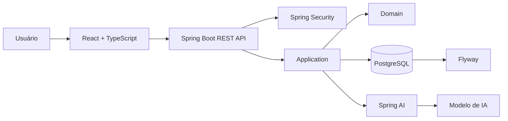

# 00 — Visão geral do FinAI

```mermaid
flowchart LR
    U[Usuário] --> FE[React + TypeScript]
    FE --> API[Spring Boot REST API]
    API --> SEC[Spring Security]
    API --> APP[Application]
    APP --> DOM[Domain]
    APP --> DB[(PostgreSQL)]
    DB --> FLY[Flyway]
    APP --> AI[Spring AI]
    AI --> LLM[Modelo de IA]
```

**Ideia principal:** Frontend → API → Application → Domain/Infrastructure → Banco.

A IA nunca acessa o banco diretamente.
