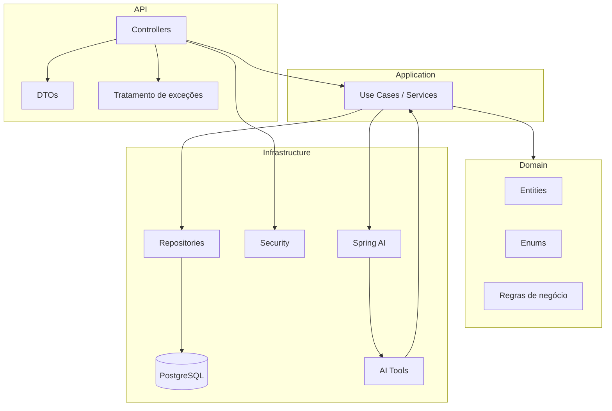

# 01 — Arquitetura do Backend


```mermaid
flowchart TB
    subgraph API["API"]
        C[Controllers]
        DTO[DTOs]
        EX[Tratamento de exceções]
    end
    subgraph APP["Application"]
        UC[Use Cases / Services]
    end
    subgraph DOM["Domain"]
        ENT[Entities]
        ENUM[Enums]
        RULES[Regras de negócio]
    end
    subgraph INFRA["Infrastructure"]
        REPO[Repositories]
        DB[(PostgreSQL)]
        SECURITY[Security]
        AI[Spring AI]
        TOOLS[AI Tools]
    end

    C --> DTO
    C --> UC
    C --> EX
    UC --> DOM
    UC --> REPO
    REPO --> DB
    C --> SECURITY
    UC --> AI
    AI --> TOOLS
    TOOLS --> UC
```

### Regra

```text
Controller → Service/Use Case → Domain → Repository → Database
```

Controller deve ser fino. Regra de negócio fica no Service/Use Case.
