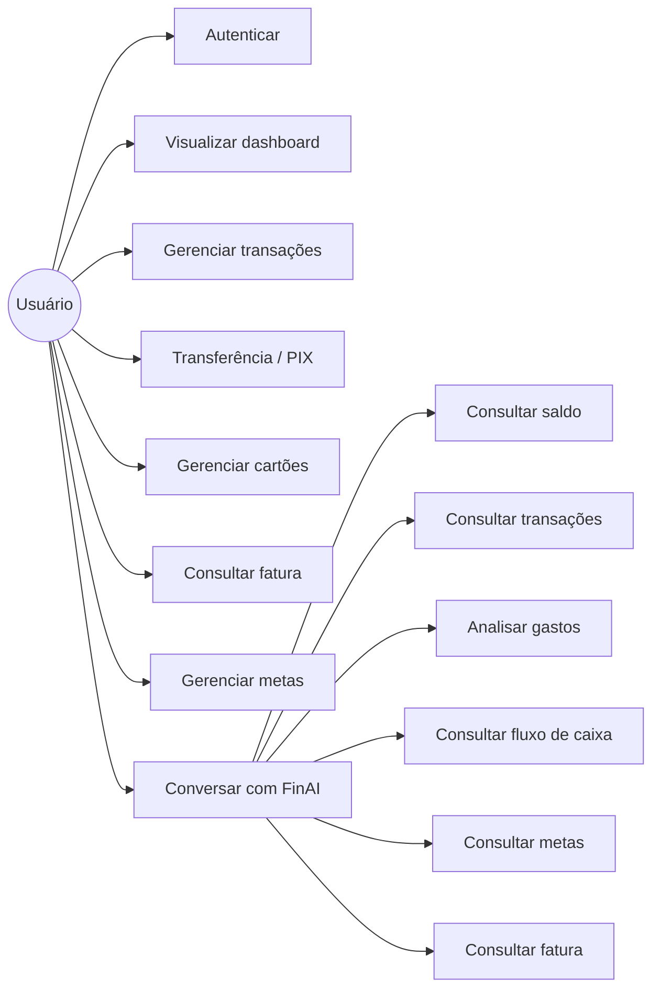

# 02 — Casos de uso

```mermaid
flowchart LR
    U((Usuário))
    U --> LOGIN[Autenticar]
    U --> DASH[Visualizar dashboard]
    U --> TRANS[Gerenciar transações]
    U --> PIX[Transferência / PIX]
    U --> CARD[Gerenciar cartões]
    U --> INV[Consultar fatura]
    U --> GOAL[Gerenciar metas]
    U --> CHAT[Conversar com FinAI]

    CHAT --> BAL[Consultar saldo]
    CHAT --> HIST[Consultar transações]
    CHAT --> CAT[Analisar gastos]
    CHAT --> CASH[Consultar fluxo de caixa]
    CHAT --> GOALS[Consultar metas]
    CHAT --> INVOICE[Consultar fatura]
```

### Ordem sugerida

1. Autenticação
2. Usuário e conta
3. Transações
4. Dashboard
5. Transferências
6. Cartões/faturas
7. Metas
8. IA
