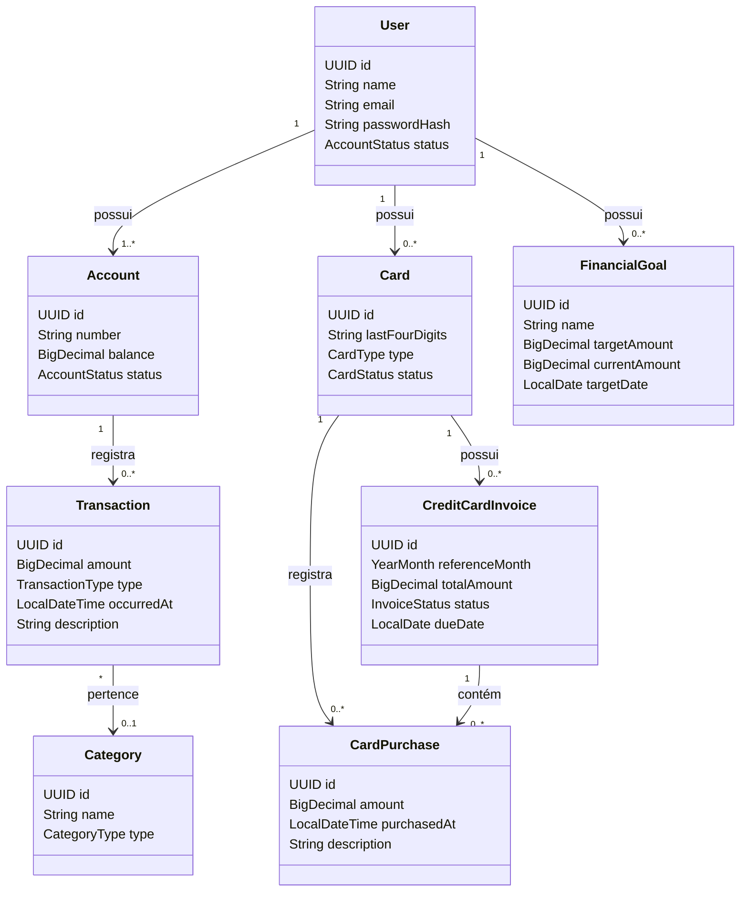

# 03 — Modelo de domínio

```mermaid
classDiagram
    class User {
        UUID id
        String name
        String email
        String passwordHash
        AccountStatus status
    }
    class Account {
        UUID id
        String number
        BigDecimal balance
        AccountStatus status
    }
    class Transaction {
        UUID id
        BigDecimal amount
        TransactionType type
        LocalDateTime occurredAt
        String description
    }
    class Category {
        UUID id
        String name
        CategoryType type
    }
    class Card {
        UUID id
        String lastFourDigits
        CardType type
        CardStatus status
    }
    class CardPurchase {
        UUID id
        BigDecimal amount
        LocalDateTime purchasedAt
        String description
    }
    class CreditCardInvoice {
        UUID id
        YearMonth referenceMonth
        BigDecimal totalAmount
        InvoiceStatus status
        LocalDate dueDate
    }
    class FinancialGoal {
        UUID id
        String name
        BigDecimal targetAmount
        BigDecimal currentAmount
        LocalDate targetDate
    }

    User "1" --> "1..*" Account : possui
    Account "1" --> "0..*" Transaction : registra
    Transaction "*" --> "0..1" Category : pertence
    User "1" --> "0..*" Card : possui
    Card "1" --> "0..*" CardPurchase : registra
    Card "1" --> "0..*" CreditCardInvoice : possui
    CreditCardInvoice "1" --> "0..*" CardPurchase : contém
    User "1" --> "0..*" FinancialGoal : possui
```

### Comece simples

Primeiro implemente `User`, `Account`, `Category` e `Transaction`. Depois adicione cartões, faturas e metas.
