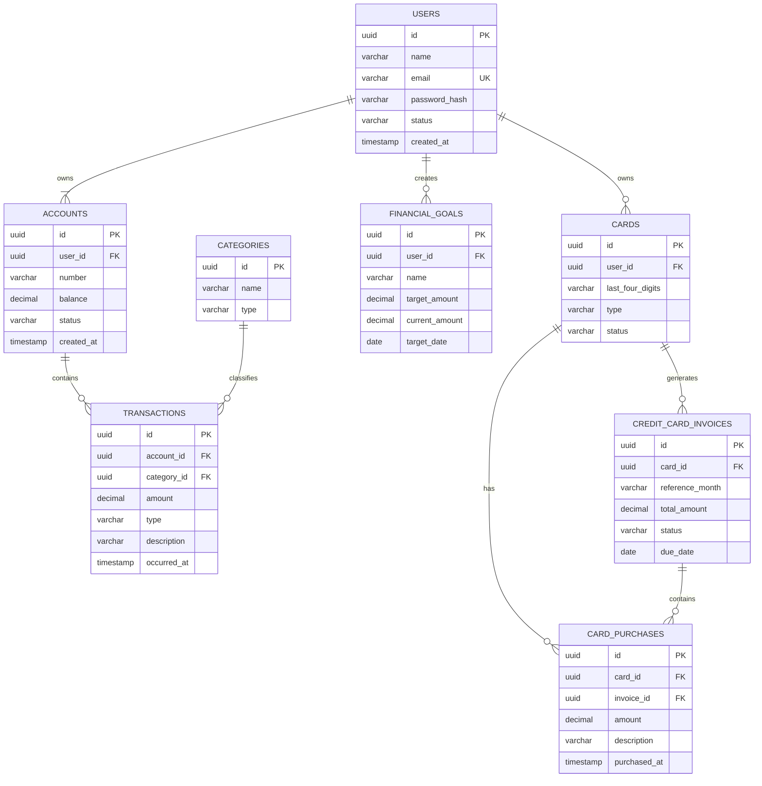

# 04 — Modelo do banco

```mermaid
erDiagram
    USERS ||--|{ ACCOUNTS : owns
    USERS ||--o{ CARDS : owns
    USERS ||--o{ FINANCIAL_GOALS : creates
    ACCOUNTS ||--o{ TRANSACTIONS : contains
    CATEGORIES ||--o{ TRANSACTIONS : classifies
    CARDS ||--o{ CARD_PURCHASES : has
    CARDS ||--o{ CREDIT_CARD_INVOICES : generates
    CREDIT_CARD_INVOICES ||--o{ CARD_PURCHASES : contains

    USERS {
        uuid id PK
        varchar name
        varchar email UK
        varchar password_hash
        varchar status
        timestamp created_at
    }
    ACCOUNTS {
        uuid id PK
        uuid user_id FK
        varchar number
        decimal balance
        varchar status
        timestamp created_at
    }
    TRANSACTIONS {
        uuid id PK
        uuid account_id FK
        uuid category_id FK
        decimal amount
        varchar type
        varchar description
        timestamp occurred_at
    }
    CATEGORIES {
        uuid id PK
        varchar name
        varchar type
    }
    CARDS {
        uuid id PK
        uuid user_id FK
        varchar last_four_digits
        varchar type
        varchar status
    }
    CARD_PURCHASES {
        uuid id PK
        uuid card_id FK
        uuid invoice_id FK
        decimal amount
        varchar description
        timestamp purchased_at
    }
    CREDIT_CARD_INVOICES {
        uuid id PK
        uuid card_id FK
        varchar reference_month
        decimal total_amount
        varchar status
        date due_date
    }
    FINANCIAL_GOALS {
        uuid id PK
        uuid user_id FK
        varchar name
        decimal target_amount
        decimal current_amount
        date target_date
    }
```

O banco deve ser criado por migrations Flyway, não manualmente.
