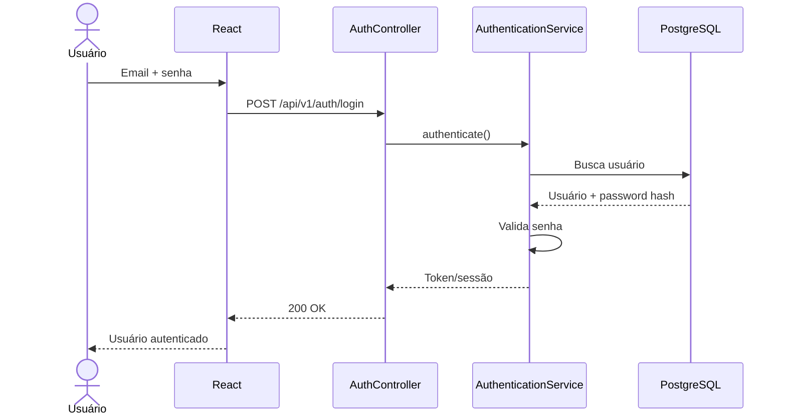

# 05 — Autenticação

```mermaid
sequenceDiagram
    actor U as Usuário
    participant FE as React
    participant API as AuthController
    participant SEC as AuthenticationService
    participant DB as PostgreSQL

    U->>FE: Email + senha
    FE->>API: POST /api/v1/auth/login
    API->>SEC: authenticate()
    SEC->>DB: Busca usuário
    DB-->>SEC: Usuário + password hash
    SEC->>SEC: Valida senha
    SEC-->>API: Token/sessão
    API-->>FE: 200 OK
    FE-->>U: Usuário autenticado
```

Nunca salve senha em texto puro.
