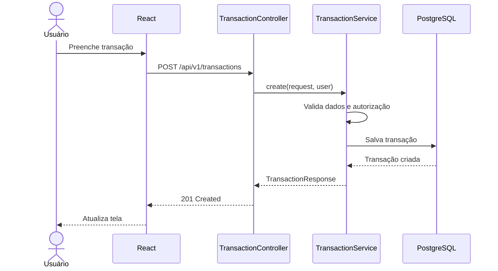

# 06 — Criar transação

```mermaid
sequenceDiagram
    actor U as Usuário
    participant FE as React
    participant API as TransactionController
    participant APP as TransactionService
    participant DB as PostgreSQL

    U->>FE: Preenche transação
    FE->>API: POST /api/v1/transactions
    API->>APP: create(request, user)
    APP->>APP: Valida dados e autorização
    APP->>DB: Salva transação
    DB-->>APP: Transação criada
    APP-->>API: TransactionResponse
    API-->>FE: 201 Created
    FE-->>U: Atualiza tela
```

Regra financeira fica no `TransactionService`, não no React.
