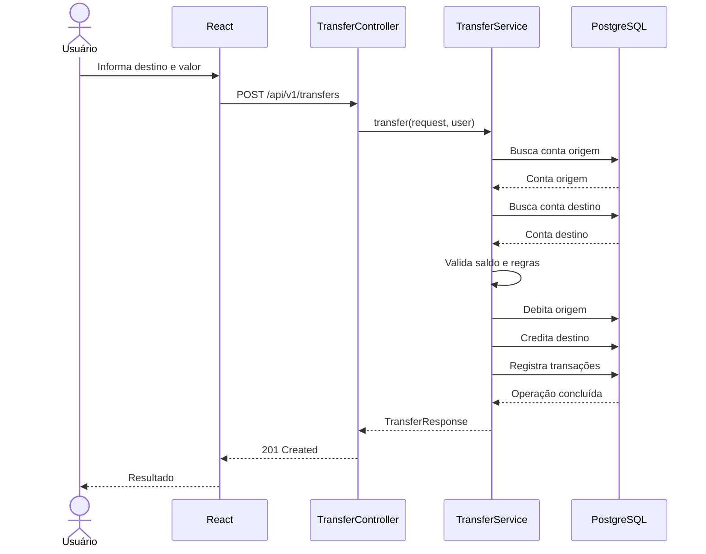

# 07 — Transferência / PIX

```mermaid
sequenceDiagram
    actor U as Usuário
    participant FE as React
    participant API as TransferController
    participant APP as TransferService
    participant DB as PostgreSQL

    U->>FE: Informa destino e valor
    FE->>API: POST /api/v1/transfers
    API->>APP: transfer(request, user)

    APP->>DB: Busca conta origem
    DB-->>APP: Conta origem
    APP->>DB: Busca conta destino
    DB-->>APP: Conta destino

    APP->>APP: Valida saldo e regras
    APP->>DB: Debita origem
    APP->>DB: Credita destino
    APP->>DB: Registra transações

    DB-->>APP: Operação concluída
    APP-->>API: TransferResponse
    API-->>FE: 201 Created
    FE-->>U: Resultado
```

A transferência deve ser uma operação transacional: débito, crédito e registros devem manter consistência.
