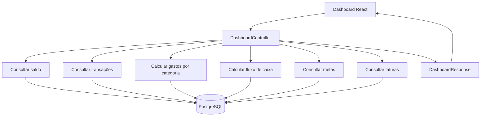

# 08 — Dashboard

```mermaid
flowchart TD
    FE[Dashboard React] --> API[DashboardController]
    API --> BAL[Consultar saldo]
    API --> TX[Consultar transações]
    API --> CAT[Calcular gastos por categoria]
    API --> CASH[Calcular fluxo de caixa]
    API --> GOAL[Consultar metas]
    API --> INV[Consultar faturas]

    BAL --> DB[(PostgreSQL)]
    TX --> DB
    CAT --> DB
    CASH --> DB
    GOAL --> DB
    INV --> DB

    API --> JSON[DashboardResponse]
    JSON --> FE
```

O backend calcula os dados financeiros; o React apresenta.
