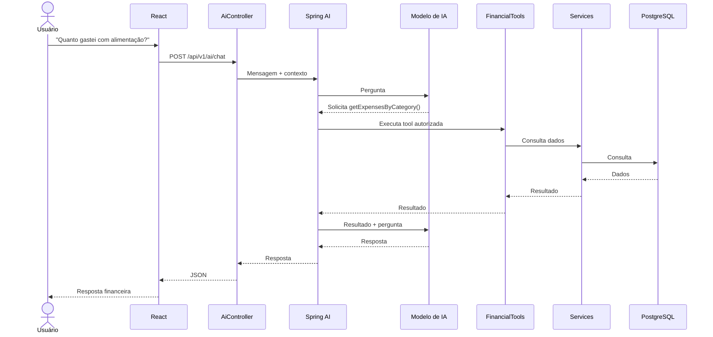

# 09 — IA + Tool Calling

### Tools iniciais

- `getCurrentBalance`
- `getTransactions`
- `getExpensesByCategory`
- `getFinancialGoals`
- `getCreditCardInvoice`
- `getCashFlow`

A IA não acessa PostgreSQL diretamente.
