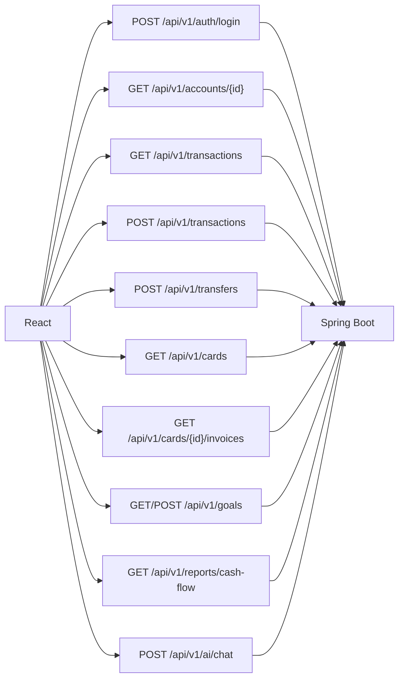

# 10 — API REST

```mermaid
flowchart LR
    FE[React]
    FE --> A["POST /api/v1/auth/login"]
    FE --> B["GET /api/v1/accounts/{id}"]
    FE --> C["GET /api/v1/transactions"]
    FE --> D["POST /api/v1/transactions"]
    FE --> E["POST /api/v1/transfers"]
    FE --> F["GET /api/v1/cards"]
    FE --> G["GET /api/v1/cards/{id}/invoices"]
    FE --> H["GET/POST /api/v1/goals"]
    FE --> I["GET /api/v1/reports/cash-flow"]
    FE --> J["POST /api/v1/ai/chat"]
    A --> API[Spring Boot]
    B --> API
    C --> API
    D --> API
    E --> API
    F --> API
    G --> API
    H --> API
    I --> API
    J --> API
```

Convenção:

- `GET` consulta
- `POST` cria/executa
- `PUT` substitui
- `PATCH` altera parcialmente
- `DELETE` remove
