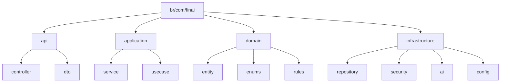

# 11 — Estrutura de pastas



### Estrutura

```text
src/main/java/br/com/finai/
├── api/
│   ├── controller/
│   └── dto/
├── application/
│   ├── service/
│   └── usecase/
├── domain/
│   ├── entity/
│   ├── enums/
│   └── rules/
└── infrastructure/
    ├── repository/
    ├── security/
    ├── ai/
    └── config/
```
