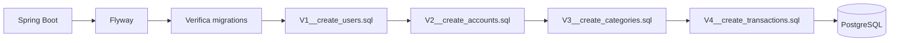

# 12 — Flyway



Exemplo:

```text
V1__create_users.sql
V2__create_accounts.sql
V3__create_categories.sql
V4__create_transactions.sql
V5__create_cards.sql
```

Depois de aplicada, uma migration não deve ser reescrita. Crie outra.
