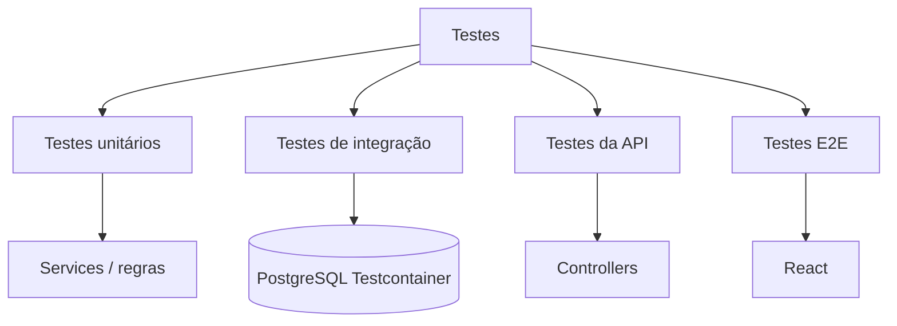

# 13 — Estratégia de testes

```mermaid
flowchart TD
    TEST[Testes] --> UNIT[Testes unitários]
    TEST --> INTEG[Testes de integração]
    TEST --> API[Testes da API]
    TEST --> E2E[Testes E2E]

    UNIT --> SERVICE[Services / regras]
    INTEG --> DB[(PostgreSQL Testcontainer)]
    API --> CONTROLLER[Controllers]
    E2E --> FRONT[React]
```

Comece testando:

- `TransactionService`
- `TransferService`
- `GoalService`

Depois use Testcontainers para testar integração com PostgreSQL.
