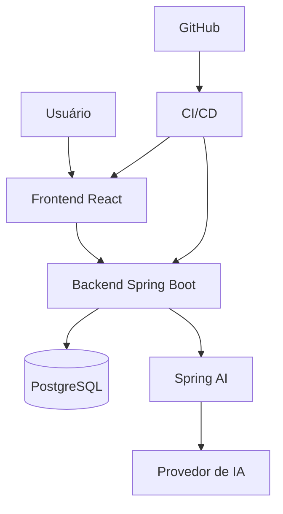

# 14 — Deployment



Local:

```text
React → Spring Boot → PostgreSQL
```

Produção:

```text
Internet → Frontend → Backend → PostgreSQL
                         ↓
                    Provedor de IA
```
