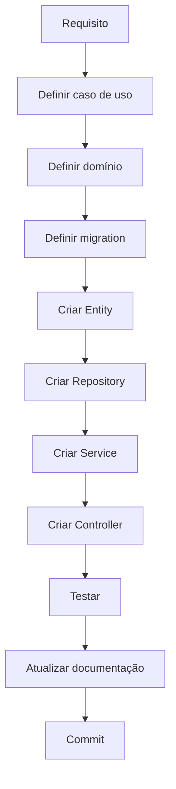

# 15 — Como implementar uma funcionalidade



### Exemplo: transação

```text
1. Ler o diagrama
2. Criar Entity
3. Criar migration
4. Criar Repository
5. Criar Service
6. Criar DTO
7. Criar Controller
8. Criar testes
9. Testar API
10. Atualizar documentação
```
