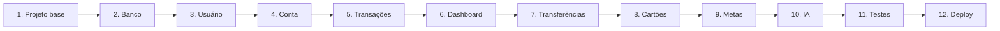

# 17 — Roadmap

```mermaid
flowchart LR
    P1["1. Projeto base"] --> P2["2. Banco"]
    P2 --> P3["3. Usuário"]
    P3 --> P4["4. Conta"]
    P4 --> P5["5. Transações"]
    P5 --> P6["6. Dashboard"]
    P6 --> P7["7. Transferências"]
    P7 --> P8["8. Cartões"]
    P8 --> P9["9. Metas"]
    P9 --> P10["10. IA"]
    P10 --> P11["11. Testes"]
    P11 --> P12["12. Deploy"]
```

### Ordem recomendada para um júnior

1. Fundação
2. Banco
3. Usuário
4. Conta
5. Transações
6. Dashboard
7. Transferências
8. Cartões/faturas
9. Metas
10. IA
11. Testes
12. Deploy
